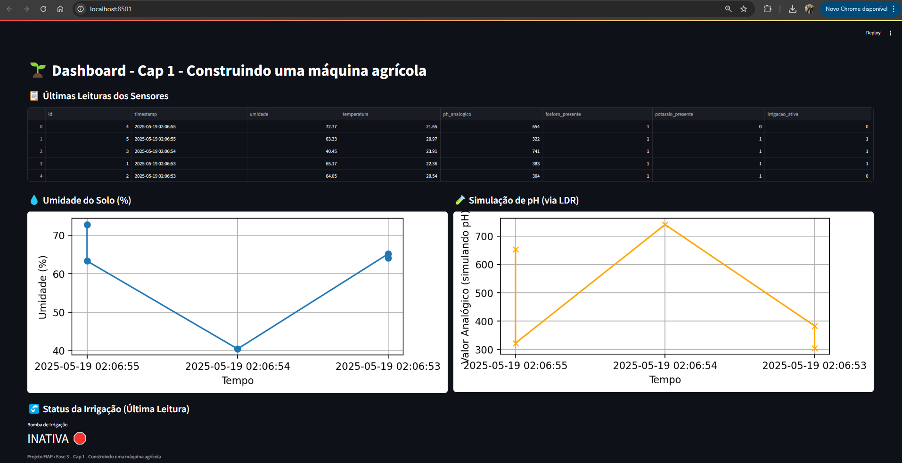

# 🌾 Projeto FIAP – Capítulo 1: Construindo uma Máquina Agrícola

[]()
[]()
[]()

---

## 💡 Descrição

Este projeto foi desenvolvido como parte da atividade do Capítulo 1 da Fase 3 na disciplina de Inteligência Artificial da FIAP. A proposta é simular, com componentes disponíveis na plataforma Wokwi, o funcionamento de sensores agrícolas em uma máquina inteligente capaz de monitorar umidade do solo, nutrientes e pH, controlando automaticamente uma bomba de irrigação. Os dados devem ser armazenados em um banco SQL com operações CRUD e possibilidade de visualização estatística.

---

## 🎯 Objetivos do Projeto

* Simular sensores agrícolas usando a plataforma Wokwi e o VS Code com PlatformIO
* Controlar um relé (bomba) com base nos dados dos sensores
* Armazenar os dados no banco de dados SQL (simulado em Python)
* Implementar operações de inserção, consulta, atualização e remoção (CRUD)
* Relacionar o modelo de dados com o MER da Fase 2
* Documentar toda a lógica no GitHub

---

## 🔌 Sensores Simulados

* **Sensor de Umidade**: DHT22
* **Sensor de pH**: LDR (resistor dependente de luz)
* **Sensor de Fósforo (P)**: botão físico (pressionado = presença)
* **Sensor de Potássio (K)**: botão físico (pressionado = presença)
* **Bomba de Irrigação**: relé, com status visível por LED

---

## 🧠 Lógica de Funcionamento (Entrega 1)

* Utilização do **VS Code com PlatformIO** e bibliotecas do Wokwi
* O ESP32 lê os sensores e decide se liga ou desliga a bomba:

  * Se umidade < 50% **e** houver presença de P ou K → **liga bomba**
  * Caso contrário → **desliga bomba**
* O status da bomba é mostrado por um LED
* Os dados são enviados via Serial Monitor
* O circuito foi construído e simulado no `diagram.json`, utilizando os pinos corretamente no `main.ino`
* **O código em C++ está comentado explicando cada etapa da lógica de leitura e decisão**
* **A imagem do circuito Wokwi foi incluída no repositório e no README a seguir:**


---

## 🗃️ Armazenamento SQL com Python (Entrega 2)

* Os dados do monitor serial são capturados e armazenados em um banco SQLite via Python
* Script `simulacao_banco.py` implementa:

  * Criação da tabela `leitura_sensores`
  * Inserção de registros simulados
  * Consulta, atualização e exclusão de dados
* **As quatro operações CRUD estão implementadas com funções específicas no script:**

  * `inserir_dados()`
  * `consultar_dados()`
  * `atualizar_umidade()`
  * `remover_dado()`
* **A estrutura da tabela foi inspirada no MER da Fase 2**, com entidade central `Leitura` relacionada aos sensores e atributos essenciais da análise agrícola.
* Justificativa: Como o foco da simulação é monitorar os dados em tempo real, utilizamos uma única tabela de registros históricos (`leitura_sensores`) que representa cada coleta feita pelos sensores embarcados na máquina. Essa estrutura é suficiente para representar as medições de campo no contexto do projeto pedagógico.

### 🧾 Estrutura da tabela `leitura_sensores`

| Campo              | Tipo     |
| ------------------ | -------- |
| id                 | INTEGER  |
| timestamp          | DATETIME |
| umidade            | REAL     |
| temperatura        | REAL     |
| ph\_analogico      | INTEGER  |
| fosforo\_presente  | BOOLEAN  |
| potassio\_presente | BOOLEAN  |
| irrigacao\_ativa   | BOOLEAN  |

---

## 💻 Estrutura do Projeto

```
Fase3_Cap1/
├── src/
│   └── main.ino                # Código ESP32
├── diagram.json                # Circuito Wokwi
├── platformio.ini              # Configuração PlatformIO
├── wokwi.toml                  # Configuração do projeto Wokwi
├── README.md
├── python_db/
│   ├── simulacao_banco.py      # CRUD em SQLite
│   ├── dashboard.py            # Painel interativo (opcional)
│   ├── api_clima.py            # Integração com OpenWeather (opcional)
│   ├── dados_irrigacao.db      # Banco de dados local
│   └── requirements.txt
├── Dashboard_Streamlit.png     # Captura do dashboard / circuito
└── Dashboard_Streamlit.mp4     # Vídeo da aplicação
```

---

## 🚀 Execução do Projeto

### 🔧 Simulação Wokwi no VS Code (PlatformIO)

1. Instale o PlatformIO no VS Code
2. Clone o projeto com `main.ino` e `diagram.json`
3. Execute a simulação e visualize o Serial Monitor

### 🐍 Python + SQLite

```bash
cd python_db
pip install -r requirements.txt
python simulacao_banco.py
```

### 📊 Dashboard com Streamlit (Ir Além 1)

```bash
streamlit run dashboard.py
```


### 🌦️ API de Clima (Ir Além 2)

```bash
python api_clima.py
```

* Verifica previsão de chuva em tempo real
* Se previsão detectar chuva → bomba é desativada

---

## 📈 "Ir Além" - Atividades Opcionais

### 📊 Dashboard com Python

* Visualização interativa com Streamlit
* Gráficos de umidade, pH, presença de nutrientes, status da bomba

### ☁️ Integração com API OpenWeather

* Consulta de dados reais de clima via `api_clima.py`
* Influencia o acionamento da bomba

---

## 👥 Integrantes do Grupo 085

* Deivisson Gonçalves Lima – RM565095 – [deivisson.engtele@gmail.com](mailto:deivisson.engtele@gmail.com)
* Omar Calil Abrão Mustafá Assem – RM561375 – [ocama12@gmail.com](mailto:ocama12@gmail.com)
* Paulo Henrique de Sousa – RM564262 – [pauloo.sousa16@outlook.com](mailto:pauloo.sousa16@outlook.com)
* Renan Danilo dos Santos Pereira – RM566175 – [renansantos4978@gmail.com](mailto:renansantos4978@gmail.com)

---

## ✅ Status Final

Entrega concluída com todos os critérios obrigatórios atendidos e atividades "Ir Além" implementadas. Projeto pronto para apresentação, com código comentado, dashboard funcional e documentação clara no GitHub.
